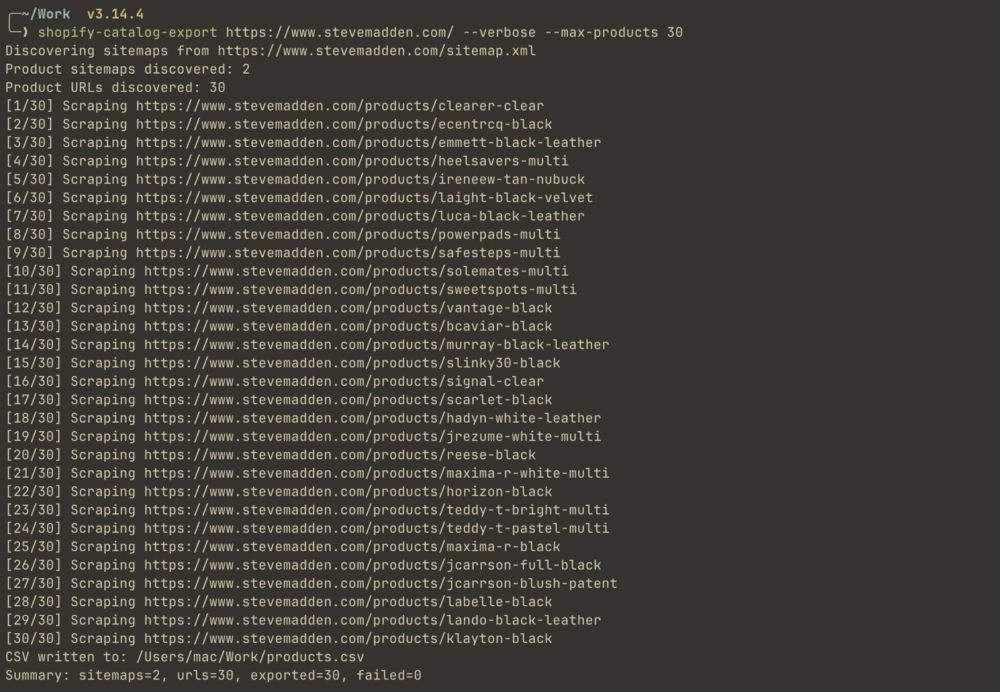

# shopify-catalog-exporter
> Scrape any public Shopify store via its sitemap and export all products to a  
> Shopify Admin-compatible import CSV — **no API key required.**
---

<p align="center">
  
</p>

<p align="center">
  <a href="https://pepy.tech/projects/shopify-catalog-exporter">
    
  </a>
  <a href="https://pypi.org/project/shopify-catalog-exporter/">
    
  </a>
  <a href="https://pypi.org/project/shopify-catalog-exporter/">
    
  </a>
  <a href="https://opensource.org/licenses/MIT">
    
  </a>
</p>

---

## Features

- 🔍 Discovers products automatically via the store's public sitemap
- 📦 Exports to a Shopify Admin-compatible CSV — ready to import as-is
- ⚡ Optional `requests` backend for faster HTTP
- 🛡️ Built-in retries, timeouts, and configurable rate limiting
- 🔑 Zero authentication — works on any public Shopify store

---

## Installation

```bash
# Standard install
pip install shopify-catalog-exporter

# With faster HTTP backend
pip install "shopify-catalog-exporter[requests]"
```

---

## Usage

```bash
# Basic export
shopify-catalog-export someshop.myshopify.com

# Custom output file with verbose logging
shopify-catalog-export someshop.com --output products.csv --verbose

# Cap products and add request delay
shopify-catalog-export someshop.com --max-products 50 --delay-ms 200
```

---

## Options

| Flag               | Default          | Description                          |
|--------------------|------------------|--------------------------------------|
| `--output`         | `products.csv`   | Output CSV path                      |
| `--template`       | auto             | Custom CSV template path             |
| `--timeout`        | `10`             | HTTP timeout in seconds              |
| `--retries`        | `2`              | Retries on failed requests           |
| `--delay-ms`       | `150`            | Delay between requests (ms)          |
| `--max-products`   | none             | Cap the number of exported products  |
| `--verbose`        | off              | Print detailed progress to stdout    |
---
